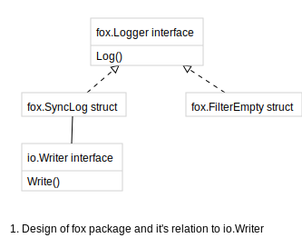

[fox](https://godoc.org/github.com/gregoryv/fox) - package provides an alternate Logger design

## Quick start

    go get github.com/gregoryv/fox

and use it with

    Log := fox.NewSyncLog(os.Stdout).Log
	Log("something")

## Design

Based on the principle that interfaces should be kept small this package
provides a Logger interface with one func only

    Log(v string)

The design separates focuses on separation.

- SyncLog only writes messages to the output ensuring each one ends with a new line
